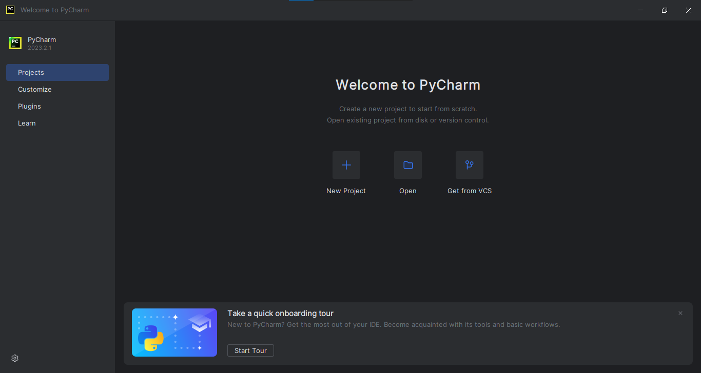
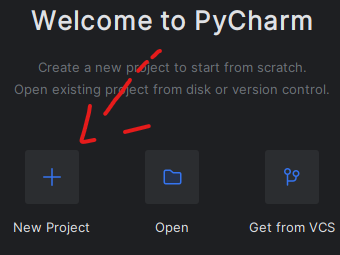
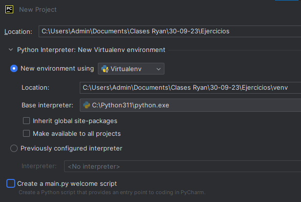
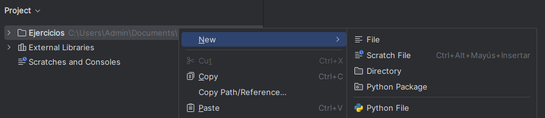
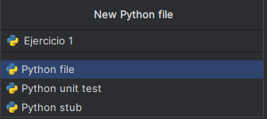

# Clase 30-09-23

## Descargar Git

Para acceder a la terminar de bash necesitamos tener instalado `Git` en nuestra maquina

- [Descargar Git](https://git-scm.com/downloads)

## Comandos de bash

Una vez dentro de la terminal de bash podemos visualizar el contenido del directorio con los comandos 

```bash
ls -h
ls -la
```

Para movernos entre carpetas vamos a utilizar el comando 

```bash
cd <Nombre de la carpeta>
```

Para movernos una carpeta atras utilizamos el comando

```bash
cd ..
```

Para movernos a la carpeta inicial en mi caso _c:/users/Admin_ vamos a utilizar el comando

```bash
cd ~
```

Para crear archivos vacios .md, .html, etc, se utiliza el comando

```bash
touch <Nombre del archivo>
```

Para eliminar archivos, carpetas se utiliza el comando

```bash
rm -rf <Nombre de la carpeta o archivo >
``` 

Para crear nuevas carpetas se utiliza el comando 

```bash
mkdir <Nombre de la carpeta >
```

# Programando con Python

## Descargar Python

- [Descargar Python](https://www.jetbrains.com/pycharm/download/download-thanks.html?platform=windows&code=PCC)

Ya que la consola de Python es poco ilegible vamos a utilizar un `Entorno de desarrollo integrado o IDE` en este caso vamos a utilizar `Pycharm`

- [Descargar Pycharm](https://www.jetbrains.com/pycharm/download/?section=windows)

## Primeros pasos en Python

Lo primero que vamos a hacer luego de haber instalado tanto Python como Pycharm (ambas son dos instalaciones bastante simples solo es dar click en el botón siguiente) es entrar al `IDE`.

Al ingresar a Pycharm tendremos esta vista 



Lo siguiente que debemos hacer es crear nuestro primer proyecto, damos click en el apartado `New proyect`



En el apartado de `Crear proyecto` vamos a escoger el directorio donde queremos que se cree nuestro proyecto en mi caso lo creo en la ruta _C:\Users\Admin\Documents\Clases Ryan\30-09-23_ ademas del nombre de nuestro proyecto. En mi caso deseleciono la opción de crear un main.py y creamos el proyecto.



Una vez dentro del proyecto precionamos click derecho dentro de la carpeta _Ejercicio_ nos movemos al apartado `New` y presionamos sobre `Python File` 



Lo siguiente es nombrar nuestro nuevo `Python File` en mi caso lo nombro `Ejercicio 1` y presionamos `Enter`




```py
```